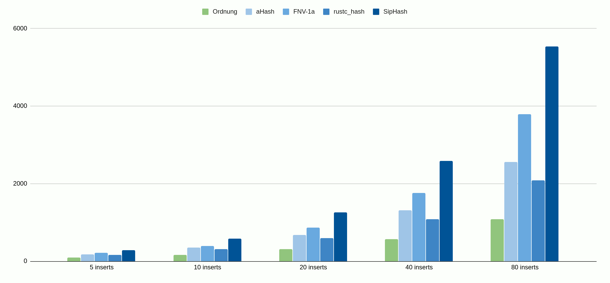
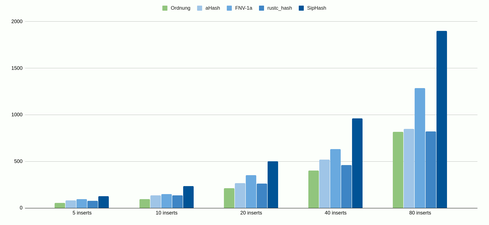
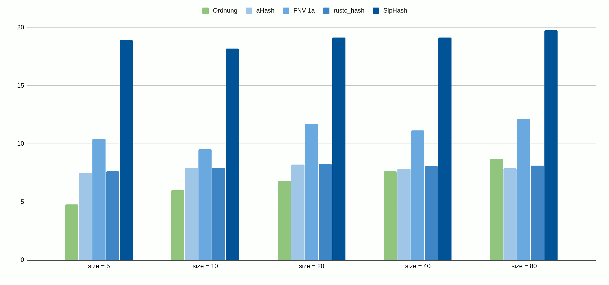

# Ordnung

Fast, vector-based map implementation that preserves insertion order.

+ Map is implemented as a binary tree over a `Vec` for storage, with only
  two extra words per entry for book-keeping on 64-bit architectures.
+ A fast hash function with good random distribution is used to balance the
  tree. Ordnung makes no guarantees that the tree will be perfectly
  balanced, but key lookup should be approaching `O(log n)` in most cases.
+ Tree traversal is always breadth-first and happens over a single
  continuous block of memory, which makes it cache friendly.
+ Iterating over all entries is always `O(n)`, same as `Vec<(K, V)>`.
+ Removing a value uses a sentinel and is `~O(log n)`.
+ There are no buckets, so there is no need to re-bucket things when growing
  the map.

## When should you use this?

+ You need to preserve insertion order of the map.
+ Iterating over the map is very performance sensitive.
+ Your average map has fewer than 100 entries.
+ You have no a priori knowledge about the final size of the map when you
  start creating it.

## Benchmarks

+ All charts show time in ns, **smaller is better**.
+ All blue bars are std `HashMap` (SwissTable) with different hashing algorithms.
+ All benchmarks were compiled with `-C target-cpu=native` to take advantage of [`aHash`](https://github.com/tkaitchuck/ahash).

### Map construction

While insertion in **Ordnung** is getting progressively slower as the size of the
map grows, growing a `HashMap` is also getting progressively slower due to
re-bucketing costs.

### Map construction with preallocated memory

With preallocated memory, **Ordnung** is still faster for a small number of entries.

### Average time to find value by key

As the size of the map doubles, **Ordnung** incurs a roughly constant jump in cost
due to its `~O(log n)` nature, however it still remains competitive with fast
`HashMap`s.

## License

This code is distributed under the terms of both the MIT license
and the Apache License (Version 2.0), choose whatever works for you.

See [LICENSE-APACHE](LICENSE-APACHE) and [LICENSE-MIT](LICENSE-MIT) for details.
